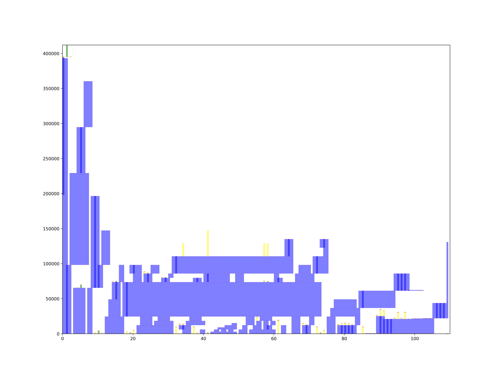

# MTE
MTE是面向MCU的深度学习模型推理引擎，包括前端（模型的分析，优化，部署）以及后端（算子的实现）。
MTE相比于现有的推理引擎有着以下优点
 - 完全开源，同时有着完整的前后端
 - 支持自定义的模型读取与自定义算子实现
 - 支持弱原地算子
 - 支持多种内存分配算法
 - 支持单次多模型部署
 - 高度优化的算子库
# 环境准备
MTE是一个混合语言项目，使用Python开发前端，使用C语言开发后端，建议使用CLion进行开发与调试，以避免繁琐的命令。
## Ptyhon开发环境准备
创建一个虚拟环境，并安装以下库。

```angular2html
pip install tensorflow==2.13.0
pip install onnxruntime==1.18.1
pip install tqdm 
```

## C语言开发环境准备
 - 下载[MinGW](https://github.com/niXman/mingw-builds-binaries/releases)并解压。
 - 下载[gcc-arm-none-eabi](https://developer.arm.com/downloads/-/gnu-rm)并解压。
 - 下载[OpenOCD](https://www.openocd.org/)

# 使用方法
克隆项目到本地，并初始化附属模块。

```angular2html
git clone https://github.com/HomiKetalys/MTE
cd MTE
git submodule update --init --recursive
```

## 生成代码

以生成一个在COCO2017数据集上训练好的目标检测模型[yolov10t](assets/yolov10t.tflite)为例,运行以下代码生成yolov10t的C语言代码。
```python
from mte_cg.gen_c_model import gen_codes_from_models
# If you have defined op, import the py file of your custom op
import examples.custom_op

if __name__ == '__main__':
    model_paths=[
        "./assets/yolov10t.tflite",
    ]
    model_names=[
        "network_1",
    ]
    gen_codes_from_models(model_paths,"./temp/c_codes","./temp",model_names=model_names)
```
随后程序将会在指定位置生成代码以及中间文件， 如yolov10t模型的内存分配图示。


## 编译

### 调试
如果你想在某个目标平台上进行调试，以gd32h759i为例，
实现文件夹dev_projects/cortex-m7/targets/gd32h759i/lib/下的timer.c，timer.h，uart.c，uart.h四个文件，以及上级文件夹中的flash.ld，startup.S文件，
并根据你的目标平台编写对应的OpenOCD文件（board,target）。
设置dev_projects/cortex-m7/targets/gd32h759i/CMakeLists.txt中的MODEL_PATH。
打开CMD运行以下命令生成elf文件。
```
"{CMAKE_BIN_PATH}/cmake.exe" -S F:\MyWork\ClionWork\MTE\dev_projects\cortex-m7\targets\gd32h759i -B F:\MyWork\ClionWork\MTE\dev_projects\cortex-m7\targets\gd32h759i\cmake-build-debug -G "MinGW Makefiles" -DCMAKE_BUILD_TYPE=Debug -DCMAKE_MAKE_PROGRAM={MinGW_BIN_PATH}/mingw32-make.exe -DCMAKE_C_COMPILER={GCC_BIN_PATH}/arm-none-eabi-gcc.exe -DCMAKE_CXX_COMPILER={GCC_BIN_PATH}/arm-none-eabi-g++.exe
"{CMAKE_BIN_PATH}/cmake.exe" --build F:\MyWork\ClionWork\MTE\dev_projects\cortex-m7\targets\gd32h759i\cmake-build-debug --target cortex-m7 -- -j 14
"{CMAKE_BIN_PATH}/cmake.exe" -SF:\MyWork\ClionWork\MTE\dev_projects\cortex-m7\targets\gd32h759i -BF:\MyWork\ClionWork\MTE\dev_projects\cortex-m7\targets\gd32h759i\cmake-build-debug --check-build-system CMakeFiles\Makefile.cmake 0
```
启动你的目标平台并连接好相关接口，运行以下命令进行烧录。
```
"{OPENOCD_BIN_PATH}/openocd.exe" -f F:/MyWork/ClionWork/MTE/dev_projects/cortex-m7/targets/gd32h759i/board.cfg -c "program F:/MyWork/ClionWork/MTE/dev_projects/cortex-m7/targets/gd32h759i/cmake-build-debug/cortex-m7.elf verify reset exit"
```
随后即可使用OpenOCD对模型进行调试。

# 自定义算子
你可以添加自定义算子来兼容你的模型，examples文件夹中提供了MAX_POOL_2D算子的添加示例。
```python
from mte_cg.base import MteOp, ModelReader, OPERATOR, TFLiteReader

@OPERATOR.register_operator("CUSTOM_OP_NAME")
def custom_op_name_parse_func(op_idx, model_reader:ModelReader):
    op=CustomOP(op_idx)
    return op

class CustomOP(MteOp):
    _inplace=False
    def __init__(self,op_idx):
        super().__init__(op_idx)

    def op_post_process(self):
        return []

    def get_call_func(self):
        raise NotImplementedError
    
    def get_c_file_paths(self):
        raise NotImplementedError
```
继承MteOp类来实现一个自定义算子,实现op_post_process，get_call_func，get_c_file_paths方法。
同时实现custom_op_name_parse_func函数来对算子的参数进行解析。

# 引用
 - [TinyEngine](https://github.com/mit-han-lab/tinyengine)
